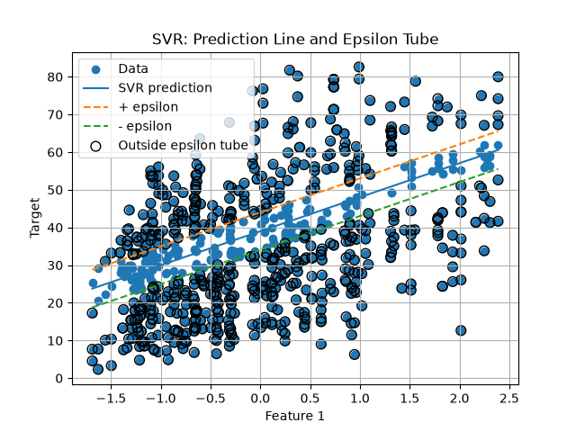

# Support Vector Regression from Scratch

This project implements Support Vector Regression (SVR) from scratch without relying on machine learning libraries for the core algorithm. The implementation is validated by comparing its performance with scikit-learn's `SVR` on the Concrete Compressive Strength dataset.

## Features

* Support Vector Regression implemented from scratch
* Linear regression function
* Epsilon-insensitive loss
* Margin-based regression
* Support vector identification
* Gradient-based optimization
* Regularization
* Prediction using the learned regression function
* Model evaluation using MSE, MAE, and R² score
* Comparison with scikit-learn
* Support vector machine Regression visualization

## Dataset

**Concrete Compressive Strength Dataset**

Source:

UCI Machine Learning Repository

The dataset contains information about the composition of concrete and its resulting compressive strength.

The dataset contains **1,030 samples and 8 numerical input features**.

### Features

* Cement
* Blast Furnace Slag
* Fly Ash
* Water
* Superplasticizer
* Coarse Aggregate
* Fine Aggregate
* Age

### Target

**Concrete Compressive Strength**

The target represents the compressive strength of the concrete in MPa.

## Algorithm

Support Vector Regression (SVR) is a supervised machine learning algorithm used to predict continuous target values.

Unlike ordinary regression, SVR attempts to find a regression function that keeps as many training samples as possible within an **epsilon ($\epsilon$) margin** around the regression function.

The regression function is:

```text id="k9xq6f"
f(x) = w · x + b
```

The epsilon margin creates a tube around the regression function.

Predictions that fall inside this tube do not contribute to the epsilon-insensitive loss.

### Epsilon-Insensitive Loss

The epsilon-insensitive loss ignores errors smaller than `ε`.

```text id="zq4g1w"
L = max(0, |y - f(x)| - ε)
```

This means:

```text id="n8mb1f"
|y - f(x)| <= ε
    ↓
Loss = 0

|y - f(x)| > ε
    ↓
Loss > 0
```

### Epsilon Margin

The regression function has two boundaries:

```text id="f5r7e3"
Upper margin:    f(x) + ε
Regression line: f(x)
Lower margin:    f(x) - ε
```

Samples inside the epsilon tube do not contribute to the epsilon-insensitive loss.

### Support Vectors

Support vectors are the training samples that lie on or outside the epsilon margin.

These samples are important because they influence the learned regression function.

Samples well inside the epsilon tube do not directly affect the SVR objective.

## Implementation

* Loaded the Concrete Compressive Strength dataset from the CSV file.
* Separated the input features and target variable.
* Split the dataset into training and testing data.
* Scaled the numerical features.
* Implemented the SVR regression function.
* Implemented epsilon-insensitive loss.
* Implemented regularization.
* Implemented gradient-based optimization.
* Trained the model using the training data.
* Identified samples that contribute to the epsilon-insensitive loss.
* Implemented prediction for unseen test data.
* Evaluated the model using MSE, MAE, and R² score.
* Compared the from-scratch implementation with scikit-learn's `SVR`.
* Visualized the regression function and epsilon margins.
* Visualized the support vectors.

## Results

### From Scratch

```text id="r2c6x1"
MSE: [142.94462121424377]
MAE: [9.51390279085945]
R² Score: [0.4452563487794974]
```

### Scikit-learn

```text id="m7v4qa"
MSE: [123.43309840722236]
MAE: [7.872709144641399]
R² Score: [ 0.5209772350282806]
```

The from-scratch implementation was compared with scikit-learn's `SVR` using the same dataset and train-test split.

## Visualizations

### SVR Regression Function

The regression visualization shows the learned regression function together with the epsilon-insensitive margin.



- max(0, |error|-epsilon)
- The training points inside epsilon-tube(margins), loss is 0.
- training points outside upper margin have positive loss, the prediction is less than actual.
- training points outside lower margin have negative loss, predicted higher than actual.

## Folder Structure

```text id="w3x9pk"
SVR_Regression/
│
├── plots/
│   ├── svr_regression.png
│   
│
├── concrete_data.csv
├── from_scratch.py
├── sklearn_model.py
├── visualization.py
└── README.md
```

## What I Learned

* Implemented Support Vector Regression from scratch.
* Learned how SVR predicts continuous target values.
* Learned how the regression function is defined using weights and bias.
* Learned how the epsilon-insensitive loss works.
* Learned why errors inside the epsilon margin are ignored.
* Learned how the epsilon parameter controls the width of the margin.
* Learned what support vectors are in SVR.
* Learned how support vectors influence the regression function.
* Learned why feature scaling is important for SVR.
* Learned how regularization affects the model.
* Learned the difference between ordinary regression and Support Vector Regression.
* Evaluated the model using MSE, MAE, and R² score.
* Compared the from-scratch implementation with scikit-learn's `SVR`.
* Visualized the regression function, epsilon margin, and support vectors.
* Learned how margins differ for classification and regression.
